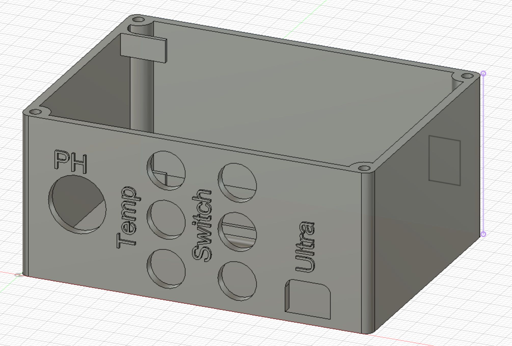
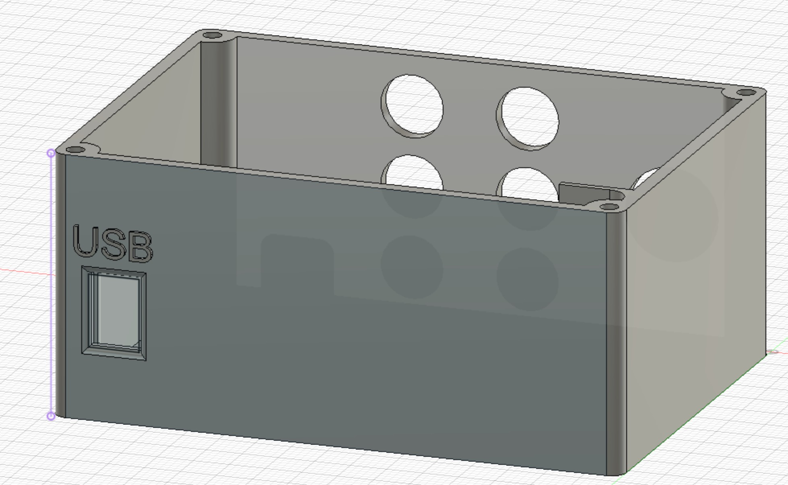
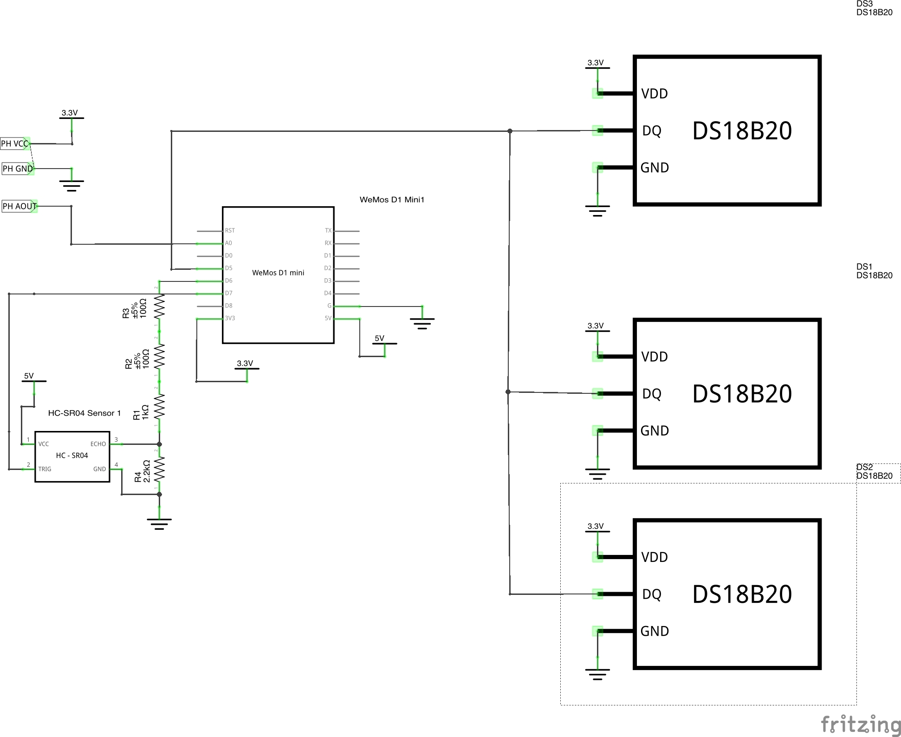

`This document is work in progress!`

# Reef Tank Controller based on Tasmota
Instructions how to build a reef/fish tank controller based on [Tasmota](http://tasmota.github.io).

Since other DIY tank controllers like [ReefPi](https://reef-pi.github.io) seemed to be overkill, I started off building my own based on the microcontroller ESP8266.

I own a Red Sea Reefer 250 tank, therefore some things you find here, might be specific to this particular tank - even I tried to make anything generic for easy re-use.

# Overview
Tasmota-Reefcontroller is acutally not a single central controller, it is many small controllers that can act indipendantly from each other. This dramatically increases fault tolerance, since e.g. your temperature sensor failing, wouldn't automatically mean that your heater produces fish soup.

# MQTT Broker
The indipendant controllers are all connected via wifi to a central [MQTT](https://mqtt.org) broker. The broker will be used for reporting only. Most of the critical functions / rules are configured directly on the indiviual controllers. Therefore even if the central Broker or even the Wifi fails, your tank will still work as usual.

# Presentation Hub / UI
For presenting the data, manually controlling things (e.g. pausing stream pumps for feeding) we use [Homeassistant](http://homeassistant.io). It comes with a whole ecosystem of smart home stuff, including an smartphone app, MQTT connectivity, ...

If you don't already run an Homeassistant server for other purposes, a good starting point would be to use [Homeassistant OS](https://www.home-assistant.io/hassio/installation/) to get you up and running. It is basically a Raspberry Pi SD card image that comes with all the stuff you need preinstalled.

# Controllers
The controllers we use are all designed for using the [Wemos D1 mini](https://www.wemos.cc/en/latest/d1/d1_mini.html) as controller. You can use any chip supported by tasmota as well, but the case desings and ciruit diagrams will need to be modified then.

## Sensor Controller

**Features**
- Measure PH (1 probe)
- Measure Temperature (3 or more probes)
- Measure Waterlevel of RO Reservoir
- 3 Digital Multi purpose IOs (e.g. float switches)

**Bill of Materials**
- 1x Wemos D1 Mini
- 1x Analog PH Sensor Circuit (Bundles including probe available for ~30-35USD. Any analog board capable of dealing with 3.3V VCC should work)
- 1x PH Probe (BNC Connector)
- 6x 3.5mm stereo jack plugs
- 6x 3.5mm stereo jack sockets
- 1x 3-pole pin header
- 2x 3-pole pin sockets
- 1x Micro USB to USB-A cable
- 1x USB Powerbrick
- 1x [SR04 Ultrasonic ranging sensor](https://tasmota.github.io/docs/HC-SR04/)
- 3x [DS18x20](https://tasmota.github.io/docs/DS18x20/), optimally waterproof version
- 1x 3D-Printed case + Lid for Controller
- 1x 3D-Printed case + Lid for SR04
- 1x 3D-Printed holder for SR04 case
- 3x Stackable Wemos Breakout Shields

**Wemos D1 Mini pinout**

- `A0` PH Probe Analog Out
- `TX` `GPIO1`
- `RX` `GPIO3`
- `D0` `GPIO16` 
- `D1` `GPIO5` I2C SCL
- `D2` `GPIO4` I2C SDA
- `D3` `GPIO0` 
- `D4` `GPIO2` Onboard LED
- `D5` `GPIO14` 1 Wire to DS18x20s
- `D6` `GPIO12` SR04 Echo/RX
- `D7` `GPIO13` SR04 Tri/RX

## Power Socket Controller
This Controller is the simplest of all, since it uses the ready-to-use device [Shelly Plug S](https://shelly.cloud/products/shelly-plug-s-smart-home-automation-device/). The device is compatible with Tasmota. There are various 

**Features**
- On/Off based on schedule or measurement of sensor controller
- Power / Consumption measurement of connected device 
- Indicator LED ring to show state of connected device

**Bill of Materials**
- As many Shelly Plug S as you would like to control devices
- USB to serial converter to flash the devices with Tasmota

## Display Controller
*Comming soon*

## Heating + Cooling Controller
*Comming soon*

## Stream pumps Controller
*Comming soon*

# FAQ

**Why not use a commercial controller, e.g. Neptune Systems Apex or GHL Profilux?**
- Neptune Apex is not available in Germany
- None of the two is open source
- They are by factors more expensive than any DIY solution
- You dont learn anything by just buying stuff 

**Why not build a [ReefPi](https://reef-pi.github.io) instead?**

1. Reliability first - its about the lives of your fish! The centralized architecture of ReefPi introduces a single point of failure
1. I don't need another fancy UI, since I use the one of my home automation system.
2. ReefPi is in the end a linux server. Therefore it needs to be maintained, backed up, updated... just a lot of work.
3. Controlling line voltage via some DIY circuitry doesn't seem to be a good idea, unless you are an professional electrician 
4. Needs a lot of the rare physical space in my tank cabinet

**What is required to build it on my own?**
- A 3D printer (or someone that can 3D print things for you)
- Very basic electronics knowledge
- Lots of time ;-)

**How much does the build cost?**

Depending on the hardware you choose, you can achieve most of the things with very little (monitary) investment. If you order most of the components directly in china, about 40USD should be enough for building the measurment controller.
